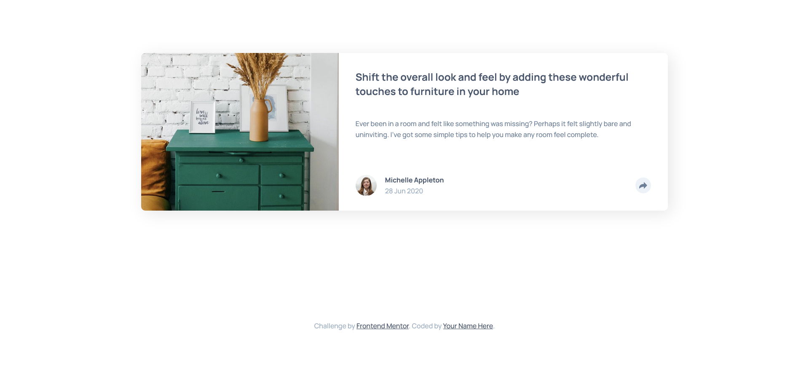

# Frontend Mentor - Article preview component solution

This is a solution to the [Article preview component challenge on Frontend Mentor](https://www.frontendmentor.io/challenges/article-preview-component-dYBN_pYFT). Frontend Mentor challenges help you improve your coding skills by building realistic projects. 

## Table of contents

- [Overview](#overview)
  - [The challenge](#the-challenge)
  - [Screenshot](#screenshot)
- [My process](#my-process)
  - [Built with](#built-with)
  - [Links](#links)
- [Author](#author)

## Overview

### The challenge

Users should be able to:

- View the optimal layout for the component depending on their device's screen size
- See the social media share links when they click the share icon

### Screenshot

## My process

### Built with

- Semantic HTML5 markup
- CSS custom properties
- Flexbox
- CSS Grid
- Mobile-first workflow

### Links

- Solution URL: [GitHub repository](https://github.com/rafacovez/article-preview-component-master)
- Live Site URL: [Live site](https://article-preview-component-master-gold-ten.vercel.app/)

## Author

- Frontend Mentor - [@rafdidact](https://www.frontendmentor.io/profile/rafdidact)
- FreeCodeCamp - [@rafacovez](https://www.freecodecamp.org/rafacovez)
- StackOverflow - [@rafacovez](https://stackoverflow.com/users/15068150/ad%c3%a1n-est%c3%a9vez)
- LeetCode - [@rafacovez](https://leetcode.com/rafacovez/)